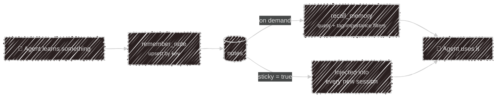

# Memory & datasets

Two kinds of remembering, kept in the same store: a [SQLite file](/configuration/storage) locally, Postgres
in the cloud.

| | **Notes** | **Datasets** |
|---|---|---|
| Shape | free-form facts | a fixed list of fields |
| Written by | the agent, unprompted | the user, one answer at a time |
| Read back | by search (`recall_memory`) | as a completed version |
| Defined where | nowhere, it grows as you talk | `marketplace/datasets/*.json` |

## Notes

The agent writes a note whenever it learns something lasting about you or your work. It doesn't ask first.

Each note has a **key** (a stable id like `user:communication-style`), the **content**, an **importance** of
`low`, `medium` or `high` that weights recall ranking, optional **tags**, and a **sticky** flag.

Notes belong to whoever is talking. The terminal, each Telegram user and, in the cloud, each widget visitor
have separate sets, so a visitor's notes never reach your chats or another visitor.



| Tool | What it does |
| --- | --- |
| `remember_note` | write or update a fact. It **upserts by key**, so the same key overwrites instead of duplicating |
| `recall_memory` | search notes, filtered by tags, minimum importance or sticky-only |
| `list_notes` | list what's stored |
| `forget_note` | delete one note by key, or every note with a tag |

**Sticky** notes skip search and go into the system prompt at the start of every session. Use them for the
few things that should always be in context, and leave the rest non-sticky so they're recalled only when
relevant.

You can ask for any of this in plain words: *"what do you remember about me?"*, *"forget the note about my
old job"*.

## Datasets

A dataset is a questionnaire the agent fills in during conversation, across as many sessions as it takes.
Datasets are [abilities](/abilities): one JSON file per topic in `~/.config/kaja/marketplace/datasets/`,
synced or your own. A [persona](/abilities/personas) opts into one with `dataset = "<id>"`. Every dataset in
the folder loads, but does nothing until a persona names it or it's a profile.

```json
{
  "label": "Mood check-in",
  "revalidateAfterDays": 7,
  "fields": [
    { "name": "mood", "prompt": "How has your week felt overall?" },
    { "name": "energy", "prompt": "How's your energy been?", "accepted": ["low", "okay", "high"] }
  ]
}
```

| Field | Purpose |
| --- | --- |
| `label` | display name (required) |
| `fields[].name` | the stored key (required) |
| `fields[].prompt` | what to ask. The agent rephrases it naturally instead of reading it out |
| `fields[].accepted` | a fixed answer list. Anything else is rejected (case-insensitively) and asked again |
| `revalidateAfterDays` | how long a completed set stays fresh before a new version starts |
| `profile` | it's about the user, so every persona sees the answers (see below) |

### The onboarding profile

The shipped `onboarding` dataset is a profile: what to call you, pronouns, age, look, where you live,
languages, work, interests, household, pets and diet. The `onboarding` persona walks you through it, but only
the name matters. Every other question is fine to skip, and a skipped one is recorded as `prefer not to say`,
so it's never asked again.

Because it's a profile, every persona gets an "About the user" section in its system prompt with what you
shared (never the skipped fields), and records a missing detail when you happen to mention it, without
quizzing you for the rest. While your name is unknown, the assistant asks for it once, kindly. Like
[sticky notes](#notes), that section goes to the model provider with each message.

### Versions

Answers are grouped into **versions**. A complete set is stamped with a completion time. Once
`revalidateAfterDays` has passed, the next check quietly opens a new version and the agent asks everything
again. That's what makes a mood or check-in questionnaire useful over time: each version is a dated snapshot
you can compare with the last.

The agent drives all of this through one tool, `dataset_info`, with four actions: `list_datasets`,
`get_status` (progress, and what's still unanswered), `answer` (record one field) and `start_new_version`
(redo the set early, when you ask).

---

Next:

[Marketplace](/abilities/marketplace){: .btn .btn-green .fs-5 }
