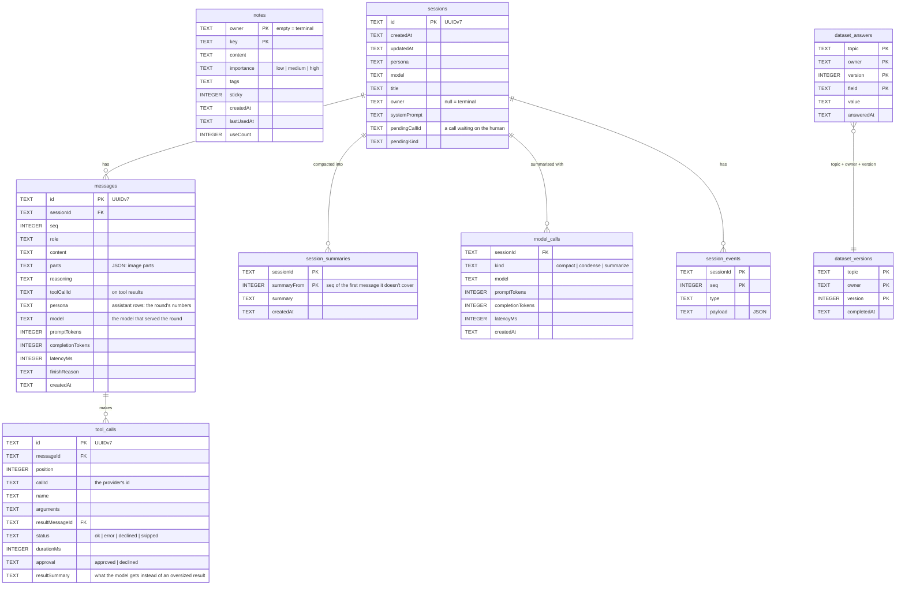

# Local storage

In [local mode](/getting-started/modes) everything Kaja remembers lives in one SQLite file on your machine,
by default in `~/.local/share/kaja/` (XDG). Change that with `[memory] dbPath` in
[`settings.toml`](/configuration/config). `kaja config paths` prints the resolved location.

The file opens in WAL mode, so the terminal chat and the Telegram bot can run at the same time.

Images the model was shown (a screenshot a tool returned, a photo sent to the bot) aren't in the database.
Each is a file under `files/images/<sessionId>/` next to it, stored once per session and named by its
sha256. Messages refer to them, and deleting a session removes its folder.

In cloud mode there's no local database: the same data lives in the server's Postgres, under your account.
The [Database](/development/database) page compares the two.

## Tables

| Table | Holds |
| --- | --- |
| `notes` | the agent's long-term [memory](/abilities/memory) about you |
| `sessions` | one row per conversation, listed by `kaja sessions` and resumable with `-c` / `-s` |
| `messages` | the conversation itself, one row per message (assistant rows are its steps, with model, tokens and latency) |
| `tool_calls` | every tool call the assistant made, linked to its result message, with how it went and how long it took. A result too big for the context also keeps the condensed version the model was sent |
| `session_summaries` | each summary a long conversation was [compacted](/configuration/config#context) into. The messages themselves are never deleted |
| `model_calls` | each request that wrote a summary (compacting, condensing, the `summarize` tool): model, tokens and time |
| `session_events` | the terminal timeline (what the screen showed), replayed when you resume |
| `dataset_answers` | individual answers to a [dataset](/abilities/memory#datasets) field |
| `dataset_versions` | marks a dataset as completed at a point in time |

`owner` separates rows within one file: empty for the terminal (`null` in `sessions`), a namespaced id for a
Telegram user or a widget visitor. Sessions belonging to another owner can't be resumed.

## Deleting it

Close Kaja (and the Telegram bot), then delete the file, any `-wal` and `-shm` files beside it, and the
`files/` folder next to it. That wipes all memory, history and saved images. There's nothing else to clean
up.

---

Next:

[Commands & doctor](/configuration/commands){: .btn .btn-green .fs-5 }
