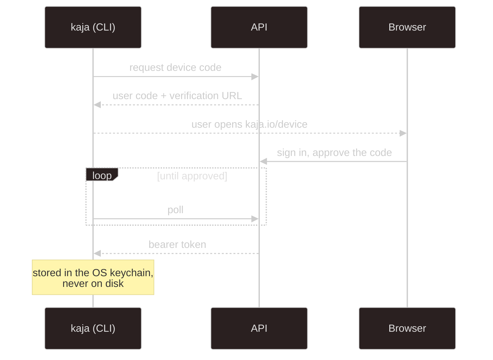

# apps/api

A Hono app with `@hono/zod-openapi` routes, PostgreSQL over the `pg` driver (raw parameterized SQL, no ORM),
and Better Auth for everything account-shaped.

In development the full OpenAPI reference is at [`localhost:3001/reference`](http://localhost:3001/reference).
That's the authoritative, always-current list. This page is the map.

## Mounts

| Prefix | Auth | What |
| --- | --- | --- |
| `/auth/*` | Better Auth | sign-up, sign-in, verification, password reset, device authorization |
| `/admin/*` | session + `admin` role | providers, models, marketplace sync, every MCP sandbox with live stats |
| `/widget/admin/*` | session | list, create, edit and revoke [widget](/using/widget) keys |
| `/abilities/me/*` | session | the user's write-only ability API keys |
| `/nasi/*` | bearer | cloud agent: turns, compaction, sessions, and the persona catalog |
| `/stats` | session | the signed-in user's own [usage numbers](#usage-stats) |
| `/sandbox/connect` | sandbox key or none | an MCP sandbox's WebSocket: it registers, then serves the MCP requests tunnelled to it |
| `/sandbox`, `/sandbox/key`, `/sandbox/settings` | session | the user's own sandboxes, their sandbox key, and whether they share or use shared ones |
| `/sandbox/public` | none | how many sandboxes are online, by country |
| `/telegram/admin/link` | session | `POST` starts linking a Telegram account to the cloud bot (returns a one-time deep link), `GET` says whether it's linked and since when, `DELETE` disconnects it |
| `/widget/<key>.js`, `/widget/turn` | widget key + Origin | the public embed |
| `/config/models` | shared secret | model resolution for tooling |
| `/config/export` | none | the model defaults and safe-commands list that `kaja config fetch` downloads |
| `/health` | none | liveness |
| `/health/ready` | none | readiness: probes the database (503 without it) and object storage (`degraded` without it); the image's `HEALTHCHECK` |
| `/reference` | none | OpenAPI UI, development builds only |

## Cloud agent: `/nasi`

The endpoints the CLI uses in [cloud mode](/getting-started/modes). All need a bearer token from device
login.

| Method | Path | Purpose |
| --- | --- | --- |
| `POST` | `/nasi/turn` | run one turn, buffered: returns the whole response |
| `POST` | `/nasi/turn/stream` | the same turn as SSE, with token deltas and a heartbeat |
| `POST` | `/nasi/compact` | summarise a session now (`/compact`), keeping its latest turn. `compacted` is null when there was nothing to summarise |
| `GET` | `/nasi/info` | which persona, model and tools this account resolves to |
| `GET` | `/nasi/personas` | every persona in the catalog (id and label, `default` first), for pickers like the widget page's |
| `GET` | `/nasi/sessions` | list this user's conversations |
| `GET` | `/nasi/sessions/{id}` | one conversation's metadata |
| `DELETE` | `/nasi/sessions/{id}` | delete a conversation |

Turn requests and responses are the `@kaja/schema/nasi` contracts. [Agent brain](/development/nasi#turn-statuses)
explains the status values and how `session` threads a conversation together. Both turn routes are
rate-limited **per user id**, not per IP, so a shared NAT doesn't starve everyone.

## Ability keys: `/abilities/me`

Every user has every ability, and each persona's `abilities` list picks what a turn uses, so there's nothing to
turn on; the only per-user part is keys.

| Method | Path | Purpose |
| --- | --- | --- |
| `GET` | `/abilities/me` | the abilities that take a key and some persona uses (name, description, required or optional, host or `sandbox`, whether the user saved one), and whether keys can be saved |
| `PUT` / `DELETE` | `/abilities/me/keys/{name}` | save (and test: an HTTP tool's `check` request, or connecting to an MCP server) or remove a key |

Keys live [encrypted in `user_secret`](/development/database#accounts-and-access), and no endpoint returns
one. Without `USER_SECRET_KEY` the key routes answer 503, and abilities that need a key are left out of the
list and of turns.

`ABILITY_KEYS` (`web-search=BSA...,other=...`) is a temporary server-wide key per ability, shared by every
cloud user. An ability with one counts as needing only an optional key, and a user's own key still wins.
Admin-managed service keys, like provider keys, are meant to replace it.

## Usage stats

`GET /stats?days=30&tz=Asia/Tokyo` (`days` 1 to 365, `tz` an IANA timezone, UTC when left out) returns the
signed-in user's own activity for the [dashboard](/development/web#signed-in): totals, one entry per calendar
day in `tz` (the web app sends the viewer's timezone, and the database keeps UTC instants either way),
sessions per channel (web or CLI, Telegram, widget), and per-tool calls with how often they asked first,
failed and how long they took. It's computed from the `nasi_message` and `nasi_tool_call` rows, so tokens,
latencies and per-reply numbers only exist for replies saved after they were recorded.

## Auth

Better Auth handles email/password with verification and reset, admin roles, and the **device authorization
grant** the CLI uses. Session cookies are prefixed `kaja`, and the CLI holds a bearer token instead.

### Rate limits and the visitor's IP

The API's own limiters and Better Auth's both key on the client IP from `X-Forwarded-For`, which the reverse
proxy sets to whoever opened the connection. The web's server-side session check (`getSession` in
`apps/web/src/lib/session.ts`) goes back out through that proxy, so to the API every page render looks like
it came from the web host, and all visitors share one bucket.

To avoid that, the web sends the visitor's IP in `x-kaja-client-ip` together with the shared `SSR_SECRET` in
`x-kaja-ssr-secret`. When the secret matches, `core/ssr-client-ip.ts` uses that IP for the Hono limiters and
rewrites `X-Forwarded-For` before the request reaches Better Auth. Both headers are always stripped, and
without a matching secret they're ignored, so nobody outside can choose their own bucket.

Generate the secret with `openssl rand -base64 32` and set the same value as `SSR_SECRET` on the API and the
web.

## Fail-closed config routes

`/config/models` is protected by a shared secret (`CONFIG_API_TOKEN`), not a user session, because it can
return provider API keys. A missing or empty token denies **every** request to it, so a misconfiguration
locks the door instead of opening it. `/config/export` is separate and public: it only serves the template
files.

## Conventions

- routes are declared with `@hono/zod-openapi` and schemas from [`@kaja/schema/api`](/development/schema)
- SQL is raw and parameterized, and user input is never interpolated
- DB row shapes stay private inside `services/`, mapped to API types by private `#rowTo…` helpers
- migrations only create, and are idempotent (see [Database](/development/database#how-the-schema-is-managed))

## Errors and logging

There's no logger package. A failure the code handles itself (which the Sentry middleware, seeing only errors
that escape a handler, would never catch) goes through `reportError`: `console.error` plus
`Sentry.captureException`, a no-op until Sentry is initialised in production. Recoverable problems are a plain
`console.warn`. The agent brain's own warnings (a skipped ability, a missing key, a failed MCP connection)
arrive through `setWarnHandler`, which the server points at `console.warn`.

## Emails

Templates are React Email components under `src/emails/`. Locally, MailDev catches everything at
[localhost:1080](http://localhost:1080), so nothing leaves the machine.

---

Next:

[Database](/development/database){: .btn .btn-green .fs-5 }
