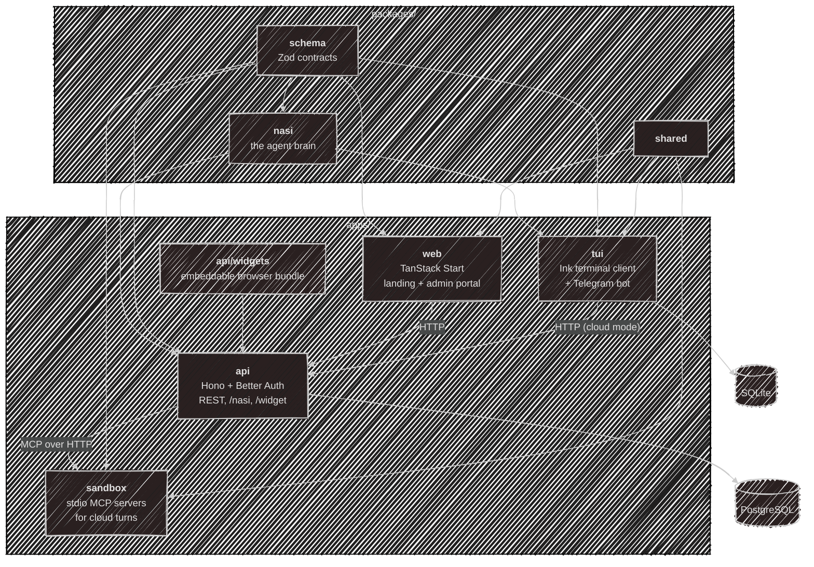

# Architecture

One Bun monorepo: four apps, three packages, and nothing on top of Bun workspaces.

## Repository map

| Workspace | What it is |
| --- | --- |
| `apps/api` | Hono REST API: auth, admin config, the cloud agent (`/nasi`), [widget](/using/widget) serving, emails |
| `apps/api/widgets` | the embeddable browser chat bundle, built as part of the API |
| `apps/web` | TanStack Start: the public landing site and the signed-in [web app](/development/web) |
| `apps/tui` | the [terminal client](/using/tui), Telegram bot, local config and storage |
| `apps/sandbox` | the [MCP sandbox](https://github.com/kajaio/kaja/tree/main/apps/sandbox#readme): runs stdio MCP servers (a headless Chrome and more) for cloud turns, one per user, behind an egress proxy that only reaches public addresses. Anyone can run one, and it dials the API's WebSocket |
| `packages/nasi` | the [agent brain](/development/nasi): loop, tools, store interface |
| `packages/schema` | every Zod [schema](/development/schema), in role-based subpaths |
| `packages/shared` | small pure utilities, including the Telegram plumbing both bots share |

The two databases are on the [Database](/development/database) page.

## Design ideas

**One brain, many hosts.** The agent loop lives in `packages/nasi` and knows nothing about terminals, HTTP or
databases. Every front door builds it with a store and a model client and drives the same loop. Adding a
front door means writing a host, not another agent.

**Offline-first is a real option.** Local mode has no account, no server and no telemetry. Config is plain
TOML, state is one SQLite file, and with Ollama or llama.cpp it needs no internet.

**The cloud is the same product, minus your machine.** It exists so someone can try Kaja without an API key.
Same loop, personas and memory, without the tools that would reach into a server's filesystem.

Deliberate non-goals: **no mobile app** (terminal, Telegram and the widget cover it), **no ORM** (raw
parameterized SQL and hand-written row mappers), and **no open publishing** (the marketplace is a curated
folder in this repo).

---

Next:

[Local setup](/development/setup){: .btn .btn-green .fs-5 }
