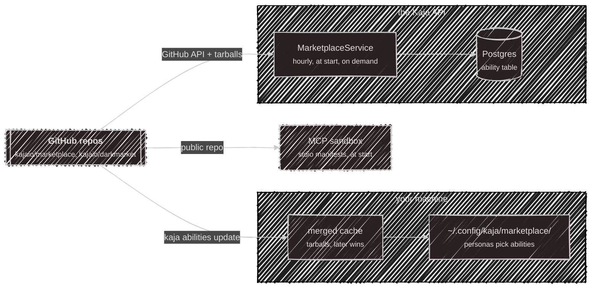
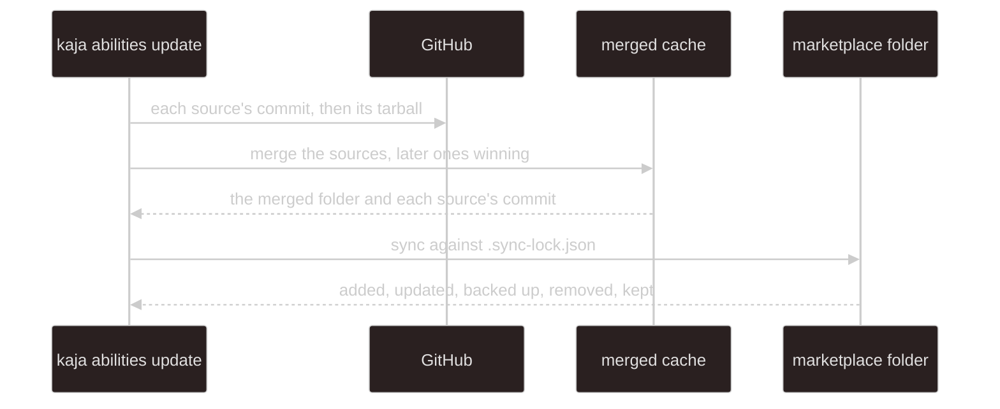
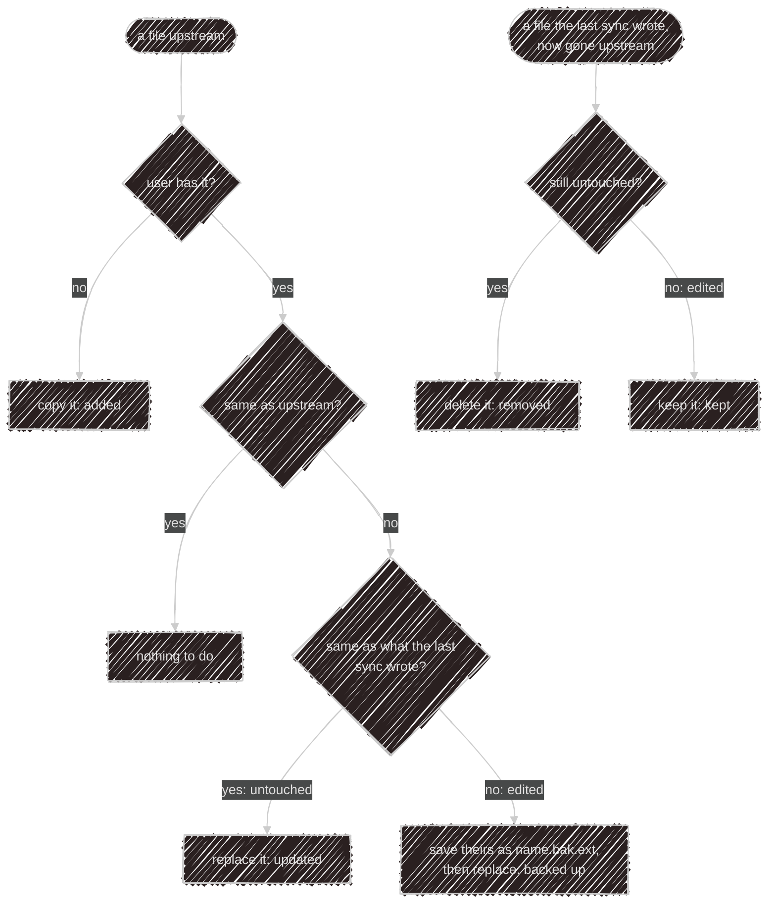
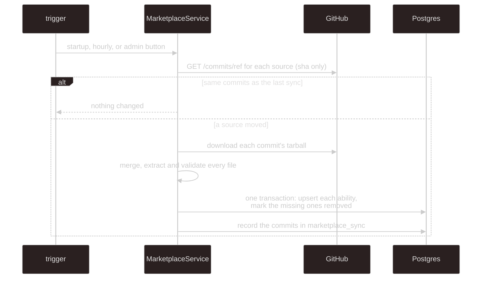

# Marketplace internals

The user side is on [Abilities](/abilities). This page is how the copies of the marketplace are kept.

The marketplace is its own repos: [kajaio/marketplace](https://github.com/kajaio/marketplace) (public) and
`kajaio/darkmarket` (private), each holding `abilities/`, `personas/` and `datasets/` at its root. There's no
publishing flow and no registry service. The owner commits a file, and each consumer (the terminal, the API,
the MCP sandbox) downloads the repos it's configured with on its own schedule. The copies are separate and
can sit at different commits: the terminal never talks to the API's copy, and the API never reads anyone's
disk.

All three use one fetcher, `@kaja/nasi`'s `sources.ts`:

- A source is a GitHub `owner/repo`, `owner/repo#ref` (default `main`), or a folder on disk (development).
- It asks GitHub for each repo's commit (`Accept: application/vnd.github.sha`), then downloads that commit's
  tarball (capped at 50 MB) and unpacks it with `Bun.Archive`, so nothing needs `git` or `tar`. A public
  repo comes from `codeload.github.com`; a token (needed for a private one) is only ever sent to
  `api.github.com`.
- Only `abilities/`, `personas/` and `datasets/` are kept, so a repo's CI files and README never reach users.
- Sources merge in order. A later one replaces an earlier one's whole ability folder, persona file or
  dataset, so two repos' files never mix inside one ability.

Each kind has one manifest format, checked by the schemas in [`@kaja/schema/abilities`](/development/schema).
Names are lowercase letters, digits and single hyphens, up to 64 characters, and must match the folder
(skills) or file name (everything else). A file that fails validation is skipped with a warning by whoever
reads it. Binary files, hidden files and backups (`name.bak.ext`, `name.bak.2.ext`) are never served to the model.

## The terminal's copy

- The sources are settings.toml's `[marketplace] sources` (default `kajaio/marketplace`), and a private one
  needs secrets.toml's `[marketplace] github_token`. Under `KAJA_PROFILE=dev` the default is a
  `../marketplace` checkout beside the Kaja source, read as a folder, so uncommitted edits sync too.
- A failed download leaves both the cache and the marketplace folder as they were.
- Each sync compares three things per file: the upstream copy, the user's copy, and the hash the previous
  sync recorded in `.sync-lock.json`:

The sync keeps the executable bit on scripts and prunes folders it emptied. At startup the terminal loads
every valid ability and persona in the folder; each persona's `abilities` list decides what a chat gets.

## The API's copy

- **Triggers.** Once at API start-up (in the background), every hour on the hour, and the admins' **Sync
  now** button. Only one sync runs at a time.
- **Cheap when idle.** The check is one GitHub API call per source. The tarballs are only downloaded when a
  source's head moved. **Sync now** always downloads them, because a new API build may accept abilities the
  old one skipped on those same commits. A folder source (development) is re-read on every sync.
- **Which repos.** `MARKETPLACE_SOURCES` (comma-separated, default `kajaio/marketplace`), plus
  `MARKETPLACE_GITHUB_TOKEN` for a private one such as `kajaio/darkmarket`. The recorded commit is each
  source's `owner/repo#ref@sha`, comma-separated.
- **Failures** are recorded in the single `marketplace_sync` row, shown in the admin panel, and reported to
  Sentry. The previous catalog stays in place.
- **Nothing is deleted.** An ability that leaves the folder gets `removed_at`. Users' selections survive and
  come back if it returns. `updated_at` only moves when the content hash changes, and that hash covers just
  what the agent sees.

An ability that can't run in the cloud is skipped at sync time, and one that stops qualifying is hidden from
the catalog:

- a skill with `scripts/`;
- an HTTP tool on a non-public host, or needing a key when the server has no `USER_SECRET_KEY`;
- an MCP server that has no `tools` allowlist, is on a non-public host, is `stdio` and needs a key, or shares
  a name with an HTTP tool (a key belongs to one name). A keyless `stdio` one is always stored, and offered
  only while the API has an [MCP sandbox](https://github.com/kajaio/kaja/tree/main/apps/sandbox#readme)
  configured;
- anything whose manifest no longer parses.

## The sandbox's copy

The [MCP sandbox](https://github.com/kajaio/kaja/tree/main/apps/sandbox#readme) only needs the stdio
`mcp.toml` manifests. It fetches `MARKETPLACE_SOURCES` (default `kajaio/marketplace`) once at startup into
`SANDBOX_STATE_DIR/marketplace`, and keeps the last copy when that fails. So a changed manifest needs a
restart, not a new image. `MARKETPLACE_DIR` points it at a folder instead (development, tests).
Community sandboxes get no token, so a private repo's stdio abilities run only on a sandbox started with it.

## Checking the content

Kaja's `bun test:marketplace` loads a `../marketplace` checkout (or `KAJA_MARKETPLACE_DIR`) the way the hosts
do: every skill, HTTP tool, MCP server and code tool must load, stdio packages must be pinned, and the
sandbox image must run what it should. Kaja's CI clones the public repo there first, so a schema change that
breaks the marketplace fails in Kaja. The marketplace repo's own CI runs the same tests against a Kaja
checkout, and `tombi lint` against the JSON Schemas Kaja publishes in `config/schemas`.

## Loading

Whichever front door a turn comes in through, [`@kaja/nasi`](/development/nasi#abilities) does the loading.
It asks an `AbilityStore` (the folder on disk, or the Postgres copy) for every ability, and turns them into
tools, skills in the system prompt, and roster personas; the active persona's `abilities` list picks which a
turn uses. The prompt's skill and persona sections
are rebuilt every turn, which is why a change applies from the next message.

| Front door | Where the personas come from |
| --- | --- |
| terminal (local), local Telegram bot | the `~/.config/kaja/marketplace/` folder |
| terminal (cloud), cloud Telegram bot | the `ability` table (with the user's keys) |
| widget | the `ability` table, skills only, starting from the key's persona |

---

Next:

[Deployment](/development/deployment){: .btn .btn-green .fs-5 }
