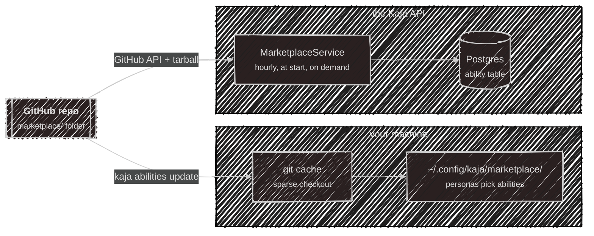
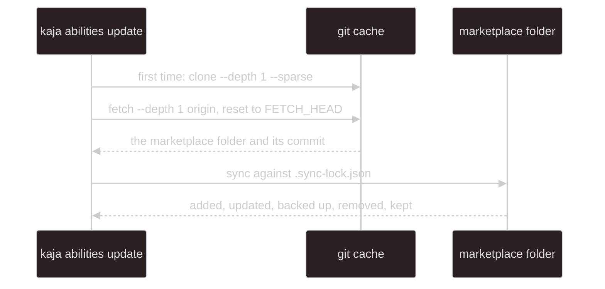
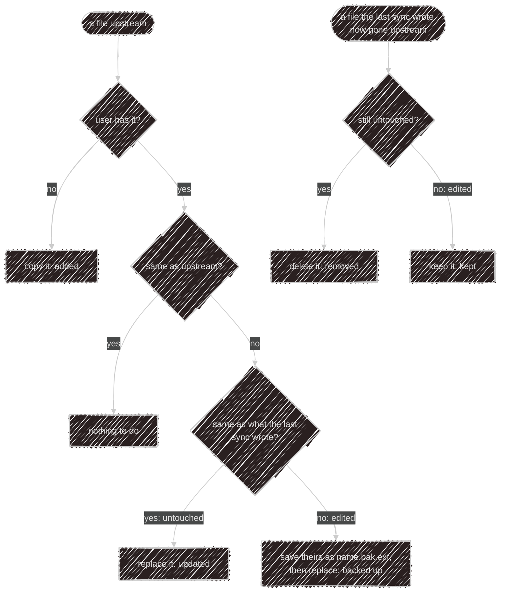
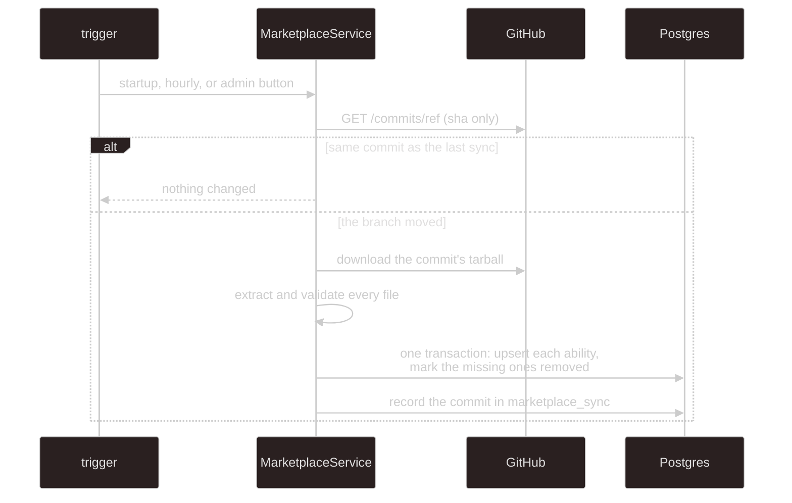

# Marketplace internals

The user side is on [Abilities](/abilities). This page is how the two copies of the `marketplace/` folder
are kept.

There's no publishing flow and no registry service. The repo owner adds a file, and two consumers copy the
folder on their own schedule. The copies are separate and can sit at different commits: the terminal never
talks to the API's copy, and the API never reads anyone's disk.

Each kind has one manifest format, checked by the schemas in [`@kaja/schema/abilities`](/development/schema).
Names are lowercase letters, digits and single hyphens, up to 64 characters, and must match the folder
(skills) or file name (everything else). A file that fails validation is skipped with a warning by whoever
reads it. Binary files, hidden files and backups (`name.bak.ext`, `name.bak.2.ext`) are never served to the model.

## The terminal's copy

- It needs `git` 2.25+ (`clone --sparse`). The version is checked first, and `kaja doctor` shows it. Prompts
  are off, so a private or mistyped URL fails instead of waiting for a password, and every git call has a
  two-minute timeout. Changing `[source] url` re-clones.
- Each sync compares three things per file: the upstream copy, the user's copy, and the hash the previous
  sync recorded in `.sync-lock.json`:

The sync keeps the executable bit on scripts and prunes folders it emptied. At startup the terminal loads
every valid ability and persona in the folder; each persona's `abilities` list decides what a chat gets.

## The API's copy

- **Triggers.** Once at API start-up (in the background), every hour on the hour, and the admins' **Sync
  now** button. Only one sync runs at a time.
- **Cheap when idle.** The check is one unauthenticated GitHub API call, so the repo must be public. The
  tarball (capped at 50 MB) is only downloaded when the branch head moved. **Sync now** always downloads it,
  because a new API build may accept abilities the old one skipped on that same commit.
- **Which repo.** `MARKETPLACE_REPO` (default `kajaio/kaja`) and `MARKETPLACE_REF` (default `main`).
- **Failures** are recorded in the single `marketplace_sync` row, shown in the admin panel, and reported to
  Sentry. The previous catalog stays in place.
- **Nothing is deleted.** An ability that leaves the folder gets `removed_at`. Users' selections survive and
  come back if it returns. `updated_at` only moves when the content hash changes, and that hash covers just
  what the agent sees.

An ability that can't run in the cloud is skipped at sync time, and one that stops qualifying is hidden from
the catalog:

- a skill with `scripts/`;
- an HTTP tool on a non-public host, or needing a key when the server has no `USER_SECRET_KEY`;
- an MCP server that has no `tools` allowlist, is on a non-public host, is `stdio` and needs a key, or shares
  a name with an HTTP tool (a key belongs to one name). A keyless `stdio` one is always stored, and offered
  only while the API has an [MCP sandbox](https://github.com/kajaio/kaja/tree/main/apps/sandbox#readme)
  configured;
- anything whose manifest no longer parses.

## Loading

Whichever front door a turn comes in through, [`@kaja/nasi`](/development/nasi#abilities) does the loading.
It asks an `AbilityStore` (the folder on disk, or the Postgres copy) for every ability, and turns them into
tools, skills in the system prompt, and roster personas; the active persona's `abilities` list picks which a
turn uses. The prompt's skill and persona sections
are rebuilt every turn, which is why a change applies from the next message.

| Front door | Where the personas come from |
| --- | --- |
| terminal (local), local Telegram bot | the `marketplace/` folder |
| terminal (cloud), cloud Telegram bot | the `ability` table (with the user's keys) |
| widget | the `ability` table, skills only, starting from the key's persona |

---

Next:

[Deployment](/development/deployment){: .btn .btn-green .fs-5 }
