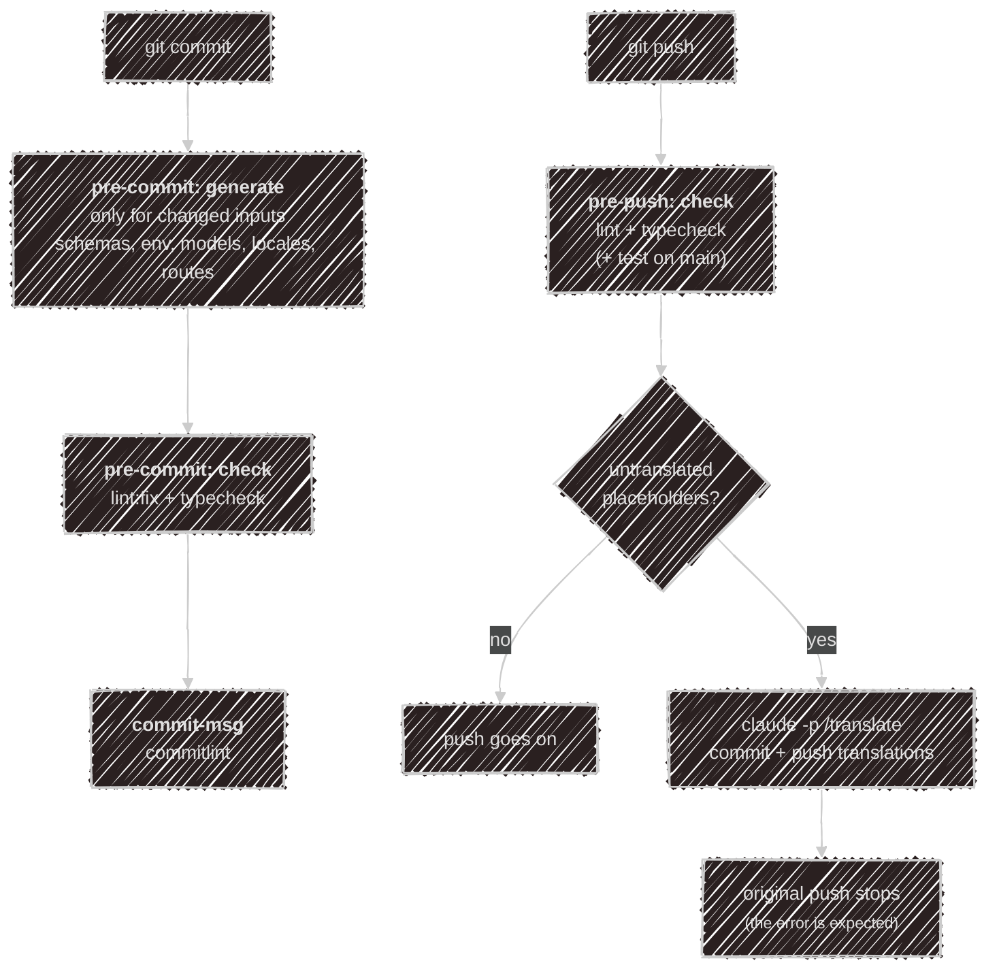

# Vibe coding

Most of Kaja is written together with a coding agent (Claude Code, which reads the `CLAUDE.md`
files). This page explains what the repo gives the agent, and what runs by itself when a
commit or a push happens, so the agent's work lands clean without you running checks by hand.

## What the agent reads

| File | What it holds |
| --- | --- |
| `CLAUDE.md` | the project map, commands, architecture and house rules; the one file the agent reads first |
| `apps/*/CLAUDE.md`, `packages/*/CLAUDE.md` | per-workspace detail, loaded when working there |
| `.claude/settings.json` | shared permissions: the agent may never read or edit a non-English locale file |
| `.claude/skills/` | slash commands, below |
| `.claude/agents/` | helper agents a skill spawns |

The locale rule is enforced, not just asked for: agents edit only the en-GB files, and translation
happens in one controlled place (`/translate`), so a stray edit can't leave the languages out of step.

## Skills

Skills are slash commands with their own instructions and a fixed list of allowed tools. Each one here
runs only when you type it; an agent never starts them on its own.

| Command | What it does |
| --- | --- |
| `/translate [locale...]` | fills the `[<locale>] lorem ipsum` placeholders in every other language |
| `/add-mcp <config>` | turns a pasted MCP server config into an `abilities/<name>/mcp.toml` ability in the `../marketplace` checkout |
| `/sonar-fix [branch]` | fixes the open SonarCloud issues on the branch's pull request |

### /translate

New or changed English gets a placeholder in every other language on commit (see
[the hooks](#git-hooks)). `/translate` replaces them:

1. `bun sync:locales --todo` lists each placeholder with its English and the already-translated keys
   near it, so terminology stays consistent.
2. The `translate-context` agent (a small, cheap model) looks up where each key shows in the code and
   notes its space limits and what its `{params}` hold.
3. The skill translates and writes back through `bun sync:locales --apply`, which rejects any entry
   whose `{params}` don't match the English.

It never opens the locale files themselves. Translations don't aim to be publication-ready; native
speakers review them later, and the skill flags the strings it was unsure about.

You rarely run it by hand: the pre-push hook runs it headless.

### /add-mcp

Paste an MCP server config (usually the JSON from its README). The skill maps it to a marketplace
manifest, starts the server to list its tools live (`.claude/skills/add-mcp/scripts/list-tools.ts`),
and checks the result against the schema and tombi. See [MCP abilities](/abilities/mcp) for the format.

### /sonar-fix

[SonarCloud](https://sonarcloud.io/project/overview?id=kajaio_kaja) analyses every pull request and
`main`. Its quality gate fails on any reliability or security issue, even a low one, which blocks the
PR. When it notifies you of a failed gate, run `/sonar-fix` on that branch:

1. `bun scripts/sonar.ts <branch>` reads the PR's open issues and unreviewed security hotspots from
   SonarCloud's public API (no token needed).
2. The skill fixes each in code, without changing behaviour. It knows the false positives and traps
   met so far (Tailwind `&` in `@utility`, randomness, Dockerfile installs, trailing-character
   regexes), and never marks issues in the SonarCloud UI instead.
3. It runs `lint:fix` and `typecheck`, and reports each issue as fixed, already gone, or left and why.

The fixes stay uncommitted for you to review. It's manual on purpose: Sonar only analyses code after
it's pushed, so a hook would always be a push behind.

## Git hooks

[Lefthook](https://github.com/evilmartians/lefthook) (`.lefthook.toml`) runs these; `bunx lefthook
install` sets them up once.

### On commit

- **Generators** run first, only when their inputs are staged, and stage what they write: JSON Schemas
  for the TOML config, `.env.example` files and `env.d.ts` typings, the model examples, the web route
  tree, and the locale sync.
- **The locale sync** (`bun sync:locales --stage`) gives every other language the same keys as en-GB. New
  or changed English becomes a `[<locale>] lorem ipsum…` placeholder, so the app never shows a missing
  key, and the push knows what's left to translate.
- **Checks**: `bun lint:fix` (Biome, plus tombi for TOML) stages what it fixes, then `bun typecheck`.
- **commitlint** checks the message: [conventional commits](https://www.conventionalcommits.org/), a
  lower-case subject, body lines of 100 characters at most.

A hook that fails aborts the commit; fix and commit again.

### On push

- `bun lint` and `bun typecheck` again, and `bun test` when pushing `main`.
- `scripts/translate_push.sh` last: when placeholders are left, it runs `claude -p "/translate"`
  headless, commits the translations as `chore(i18n): translate locale placeholders` and pushes them
  itself. Your original push then stops with an error, because the remote has moved past it; that
  error is expected, and the branch on GitHub is up to date. It needs the `claude` CLI; without it the
  push fails and asks you to run `/translate`.

## In practice

- Let the hooks do the checking: don't run lint, typecheck or the generators by hand before a commit.
- Ask the agent for English only; the rest follows on push.
- After a push, check the translation commit's notes for strings flagged for review.
- When SonarCloud fails a PR, run `/sonar-fix`, review the diff, commit and push.

---

Back to [Development](/development).
