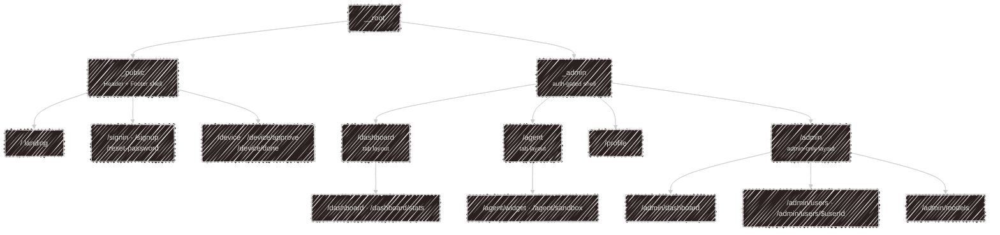

# apps/web

TanStack Start on Vite: one app with two very different route trees, kept apart on purpose.

## Public

The landing page at `/` has four sections: a hero, a showcase carousel, a feature strip and install
instructions. The carousel holds a live **barkochba game** driven by the same [widget](/using/widget) turn
endpoint a third-party site would use, and a card that opens the chat widget when the site has a chat widget
key. The game talks to the API with plain fetch instead of importing the widget workspace, so it exercises
the public contract.

`/device`, `/device/approve` and `/device/done` are where the CLI's device login lands: sign in, confirm the
code the terminal printed, done.

## Signed in

Everything behind `_admin` (the auth-gated shell, despite the name) needs a signed-in, non-banned user.

The top menu is a static list, not something each page assembles. Visitors see Sign In, Sign Up and Docs.
Signed-in users see one item per section (Dashboard, Agent and Profile), and admins also get **Admin**. A
section is a layout route with a tab bar (`SectionTabs`, tabs from `nav-items.ts`) over its pages. Every
admin-only page sits under `/admin`, whose layout also requires the Better Auth `admin` role and sends anyone
else to the dashboard. The menu hides the item and the layout enforces it.

| Route | What it is |
| --- | --- |
| `/dashboard` | a welcome and the Telegram connect card |
| `/dashboard/stats` | your [usage stats](/development/api#usage-stats) |
| `/agent/widget` | [widget keys](/using/widget#getting-a-key): create, edit, disable, delete |
| `/agent/sandbox` | your sandbox key and run command, your sandboxes (online or last seen, place, hardware, servers running; offline ones can be removed), and the share and use-shared switches |
| `/profile` | your account: name and avatar, email, password, ability API keys, and deleting it |
| `/admin/dashboard` | what the platform's services are doing right now, starting with the MCP sandboxes (`/admin` redirects here) |
| `/admin/users`, `/admin/users/$userId` | accounts, roles, bans |
| `/admin/models` | providers and their models, per task |

## Stack notes

- **Data:** React Query, with the API token pulled from the Better Auth session
- **Auth:** the Better Auth client lives in `hooks/auth-client.ts`, and cookies are prefixed `kaja`
- **Forms:** TanStack Form
- **Styling:** Tailwind v4, Base UI React primitives, lucide icons
- **i18n:** Paraglide, generated into `src/paraglide/`. Every string exists in `en-GB`, `en-US`, `hu-HU`,
  `nan-TW` and `zh-TW`
- **Errors:** anything worth knowing goes to Sentry, and user-facing errors already show a toast
- `src/routeTree.gen.ts` is generated by the router plugin. Don't hand-edit it; the pre-commit hook
  regenerates it whenever route files change

There are no automated UI tests yet.

---

Next:

[Schema](/development/schema){: .btn .btn-green .fs-5 }
