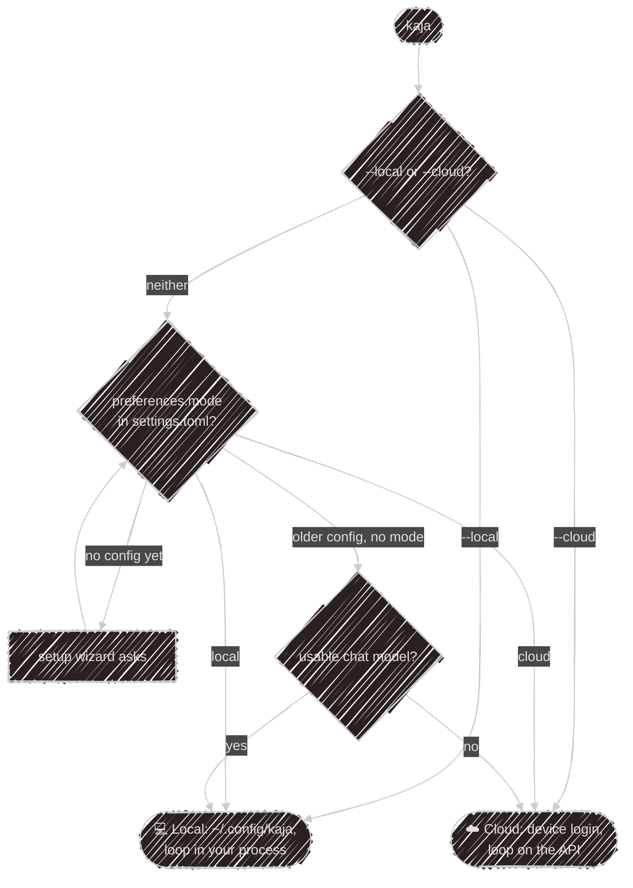
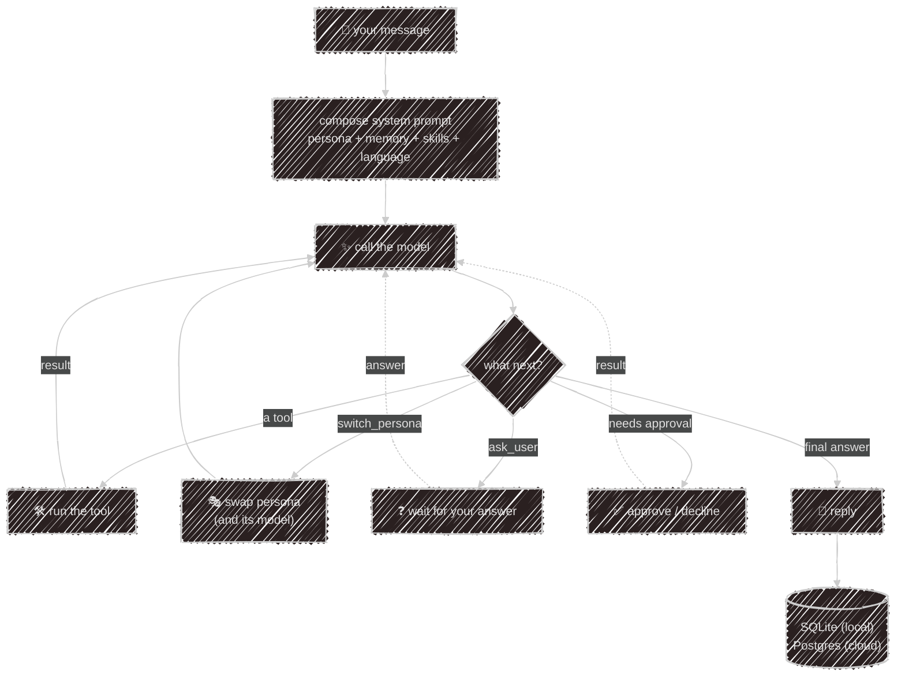

# Cloud or local

Kaja is one agent with several front doors: the terminal, Telegram and a website widget. The two modes
differ in *where the agent loop runs*, and so in which tools it can use.

| Front door | Loop runs on | Store | Your files, shell, own MCP servers and plugins |
|---|---|---|---|
| `kaja`, local mode | your machine | SQLite | ✓ |
| `kaja telegram` | your machine | SQLite | ✓ |
| `kaja`, cloud mode | the API | Postgres | ✗ (files are [read locally](#cloud-mode)) |
| cloud [Telegram bot](/using/telegram#cloud-bot) | the API | Postgres | ✗ |
| Website [widget](/using/widget) | the API | Postgres | ✗ |

## Which mode a launch uses



The [setup wizard](/getting-started/wizard) saves your choice as `preferences.mode`, even before a provider
works. A flag overrides it for one launch:

```sh
kaja --local     # local agent loop, even with no config yet
kaja --cloud     # cloud login, even if a local config exists
```

## Cloud mode

The first time, Kaja does a **device login**: it shows a code, you approve it at
[kaja.io/device](https://kaja.io/device), and a token goes into your OS keychain. Nothing is written to
disk. One account is signed in at a time, and `kaja logout` clears it.

> Without a keychain, cloud mode stops and suggests `--local`. There is no plaintext fallback.
{: .warning }

The server picks the model and keeps your sessions, memory and dataset answers. The agent can use:

- the cloud [built-in tools](/abilities/tools#built-ins): memory, datasets, `ask_user`, image generation and more;
- `read_file` and `list_files`, which run in your terminal, limited to the folder you started in and with no
  confirmation prompt;
- every persona in the marketplace, each with the skills, HTTP tools and MCP servers it lists ([Abilities in the cloud](/abilities/marketplace#in-the-cloud)).

There is no shell, no code tools and no model switching.

## Local mode

The whole agent runs in your process:

- config comes from `~/.config/kaja/` ([Configuration](/configuration/files));
- models come from your `models.toml`. Without a chat model Kaja exits with an error; it never falls back
  to the cloud;
- every tool works: files, shell, MCP servers, plugins, hosts on your own network;
- sessions, memory and dataset answers live in a [SQLite file](/configuration/storage);
- `kaja -c` resumes the last session, `kaja -s <id>` a specific one, and `kaja sessions` lists them.

## How a turn runs

Both modes run the same agent core, [Nasi](/abilities/nasi):



Two things hand control back to you:

- **`ask_user`**: the agent needs an answer. Your next message is that answer, not a new turn.
- **Approvals**: a shell command, or an HTTP tool or MCP call that changes something, waits for your OK.
  You get a prompt above the input in the terminal, and buttons in Telegram.

`switch_persona` doesn't stop anything. It swaps the [persona](/abilities/personas) and carries on.

---

Next:

[Setup wizard](/getting-started/wizard){: .btn .btn-green .fs-5 }
