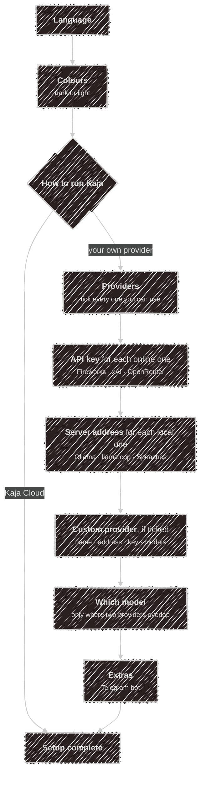

# Setup wizard

The first time you run `kaja`, a short wizard sets things up. It takes about a minute, and you can run it
again any time with `kaja config wizard`.

Every question starts with an answer already picked, so <kbd>Enter</kbd> is always a safe choice. On a
second run, the wizard starts from your previous answers.

## Before you start

- **Kaja Cloud** needs nothing. You sign in with your browser after the wizard.
- **Your own provider** needs its API key at hand (Fireworks, xAI, OpenRouter), or a running local
  server (Ollama, llama.cpp, Speaches). You can skip a key and add it later.

## Moving around

| Key | What it does |
| --- | --- |
| <kbd>↑</kbd> <kbd>↓</kbd> | Move through a list |
| <kbd>Space</kbd> | Tick or untick an item, in lists where you can pick several |
| <kbd>Enter</kbd> | Confirm and go on |
| <kbd>Esc</kbd> | Cancel the wizard from a list. Nothing is saved |

In a field you type into, <kbd>Enter</kbd> on an empty value skips it. An address keeps its usual default.
Your answers stay on screen with a ✓, so you can see what you've chosen so far.

## The questions

1. **Language.** What Kaja speaks to you in. The rest of the wizard switches right away.
2. **Colours.** Dark or light. Moving the highlight previews it, and the one matching your terminal is
   preselected. You can switch later with <kbd>Alt</kbd>+<kbd>D</kbd> ([Colours](/using/tui#colours)).
3. **How to run Kaja.**
   - **Kaja Cloud** (default): after the wizard, Kaja shows a code, you approve it in your browser, and
     you're chatting. Abilities, personas and models are chosen in the [web app](/using/web-app).
   - **Your own provider**: Kaja runs on your machine with the models you choose. The next questions
     set them up.

   Starting with `kaja --cloud` or `kaja --local` answers this for you.
4. **Providers.** Tick every provider you can use (at least one):
   - **Fireworks**, **xAI** and **OpenRouter** run online, so you give an API key.
   - **Ollama**, **llama.cpp** and **Speaches** run on your machine, so you confirm where the server
     listens. Speaches handles speech in and out for [voice](/using/voice).
   - **Custom** is any other OpenAI-compatible server (LM Studio, vLLM, a proxy). You give a name, an
     address and a key, then each model's id and what it's for. <kbd>Enter</kbd> on an empty model id
     ends the list.
5. **Which model.** Only asked when two of your providers can do the same job, say chat. You pick one.
6. **Extras.** Tick **Telegram bot** to chat from [Telegram](/using/telegram) and paste the bot token.
   Press <kbd>Enter</kbd> with nothing ticked to skip.

After the last answer the wizard carries on by itself: the marketplace, any model downloads and a check of
your keys, then **Setup complete**. A key is hidden while you type it and never shown again. It's tested
before it's saved.

## After the last question

With **Kaja Cloud** that's it. The first time, Kaja goes straight on to sign you in. After a later
`kaja config wizard`, run `kaja` to sign in.

With **your own provider**, Kaja finishes setting up first and may ask a few more things:

1. **Marketplace.** Whether to use the online [marketplace](/abilities) of skills, personas and tools
   (needs `git`), and whether to keep it up to date on its own
   ([`[marketplace]`](/configuration/config#marketplace)).
2. **Model downloads.** If your Ollama server lacks the models, one question covers all of them.
3. **Key tests.** A key is saved once the service accepts it. If it's rejected, Kaja asks whether to keep
   it anyway. Keys the finished setup turns out to need, such as an ability's, are asked for here.
5. **Model tests.** Every model gets one try, the same check [`kaja doctor`](/configuration/commands#checking-keys-and-models)
   runs. If one fails and another can do its job, you're offered the switch.

The first time, the chat starts right after. After `kaja config wizard`, you're back at your prompt.

## Where your answers go

Everything is plain text in `~/.config/kaja/`, and yours to edit afterwards:

| You answer | It becomes | In |
| --- | --- | --- |
| Language | `[preferences] locale` | [`settings.toml`](/configuration/config) |
| Colours | `[preferences] theme` | `settings.toml` |
| How to run Kaja | `[preferences] mode` | `settings.toml` |
| Providers, custom provider | `[providers.<name>]` tables and their models | [`models.toml`](/configuration/models) |
| Which model, per task | the picked model comes first among the `[models.<id>]` listing that task; every model offered stays | `models.toml` |
| A server address | `[providers.<name>] base_url` | `models.toml` |
| Speaches address | `[stt] speachesUrl`, `[tts] speachesUrl` | `settings.toml` |
| A provider's API key | `[providers.<name>] api_key` | [`secrets.toml`](/configuration/secrets) |
| Telegram bot token | `[telegram] bot_token` | `secrets.toml` |

## Running it again

`kaja config wizard` starts from your current setup, so holding <kbd>Enter</kbd> changes nothing. It does
rewrite `models.toml` from your answers, so keep a copy of hand edits. It never touches the
`marketplace/` folder.

The provider list is built in, so the wizard works offline. Without a terminal (piped input, or
`--headless`) it asks nothing and writes the default config files if you have none.

---

Next:

[Terminal UI](/using/tui){: .btn .btn-green .fs-5 }
