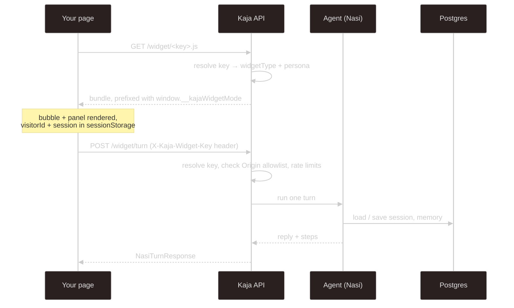

# Website widget

Put Kaja on your own site with one script tag. It adds a chat bubble in the corner, and the agent behind it
runs on the Kaja API under your account.

```html
<script src="https://api.kaja.io/widget/<widget-key>.js"></script>
```

That's all the setup on the page. Which persona answers, which UI shows, and which origins may embed it are
all tied to the key and resolved on the server.

## Getting a key

Create one on the **Widget** page of the [web app](/using/web-app):

1. Give it a **label**, so you can tell your keys apart.
2. List the **allowed origins**, the sites that may embed it: scheme and host (plus a port if it isn't the
   default), such as `https://example.com`. You need at least one, and up to 20. A pasted page URL is cut
   to its origin.
3. Pick a **type** (`chat` or `barkochba`) and, optionally, a **persona** and the **skills** it may use.

You can change the label, origins, persona and skills later. The key itself never changes.

The raw key is shown **once**, when you create it. Kaja only stores a hash and a short prefix, so if you
lose it, create a new one.

## How it works



The bundle works out the API address from its own `src` and sends the key as an `X-Kaja-Widget-Key` header
on every turn, so there's nothing else to wire up.

A visitor's state (`visitorId`, `session`) lives in `sessionStorage`, not cookies. Each visitor's
sessions, memory notes and dataset answers are kept apart inside your account. Visitors never see each
other's, and none of it mixes into yours.

## What the agent can do

A widget turn runs in [cloud mode](/getting-started/modes#cloud-mode) with the cloud
[built-in tools](/abilities/tools#built-ins), but no HTTP tools or MCP servers. A key's abilities are
**skills only** (the ones its persona lists), so a visitor can never trigger a call with your API keys. Every
persona in the catalog is available, starting with the key's own.

## Types

| Type | UI |
| --- | --- |
| `chat` | a normal chat bubble and panel |
| `barkochba` | the Twenty Questions game |

The persona decides *how the model behaves*, the type decides *what the page shows*, and you can mix them.
kaja.io runs the `barkochba` widget on its landing page.

## Limits and safety

- **The key isn't a secret.** It's visible in your page source. The real boundary is the `Origin` check: a
  turn from an origin outside the key's list is rejected with 403. Keep that list tight.
- The embed and turn routes skip the API's single `CORS_ORIGIN` (they live on third-party pages) and
  reflect the request origin instead. That's safe because nothing uses cookies. The key header is the only
  credential.
- Key lookups and turns are both rate-limited.
- Turns from one visitor run one at a time, so a fast double-send can't interleave.
- You can disable or delete a key from the Widget page at any time.

---

Next:

[Voice & language](/using/voice){: .btn .btn-green .fs-5 }
